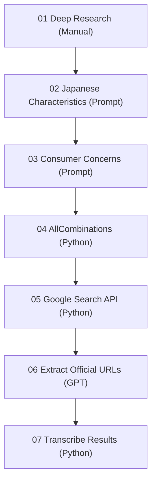

# Cross-border Research Pipeline – Japanese Products Evaluation and Keyword Automation

## 🧭 Overview
本プロジェクトは、**海外における日本製品の評価分析から、キーワード生成・検索・整形までを一気通貫で行う半自動リサーチパイプライン**です。  
GPTとPythonを組み合わせることで、「人の思考」と「機械的な自動化」を融合させ、調査から結果整備までの効率化を実現します。

---

## ⚙️ Structure
本プロジェクトは **7つのステージ** から構成されます。

| Step | Type | Folder | Description |
|------|------|---------|-------------|
| **01** | Manual | `01_deep_research_manual/` | 海外での日本製品評価をリサーチ。文化的・感情的観点を整理。 |
| **02** | Manual | `02_japanese_characteristics_manual/` | 「日本らしさ」を表す属性語リストをGPTで生成。 |
| **03** | Manual | `03_consumer_concerns_manual/` | 「消費者の悩み」をGPTで抽出し、A/B/Cキーワードの構成を定義。 |
| **04** | Auto (Python) | `04_all_combinations_auto/` | A/B/C列の直積でロングテールキーワードを自動生成。 |
| **05** | Auto (Python) | `05_google_cse_auto/` | 生成キーワードをGoogle Custom Search APIで自動検索。 |
| **06** | Manual (GPT) | `06_extract_official_urls_manual/` | 検索結果URLをGPTで「公式／非公式」に分類。 |
| **07** | Auto (Python) | `07_transcribe_auto/` | 分類結果をExcelへ転記し、最終成果物を生成。 |

---

## 🔄 Workflow

